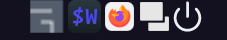
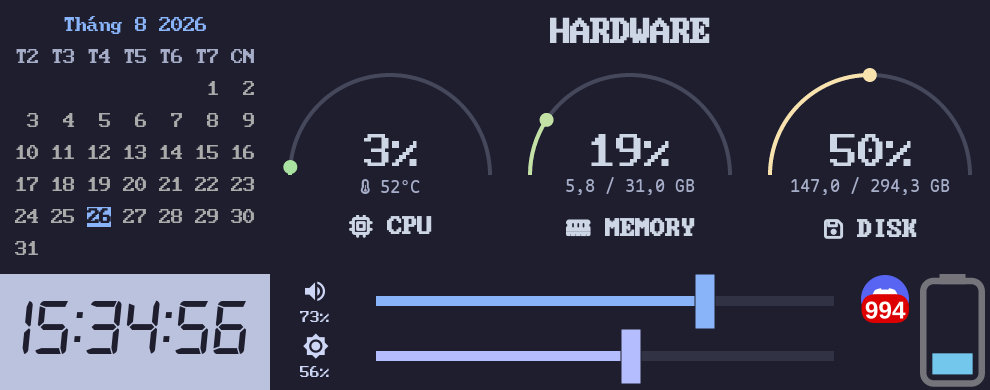
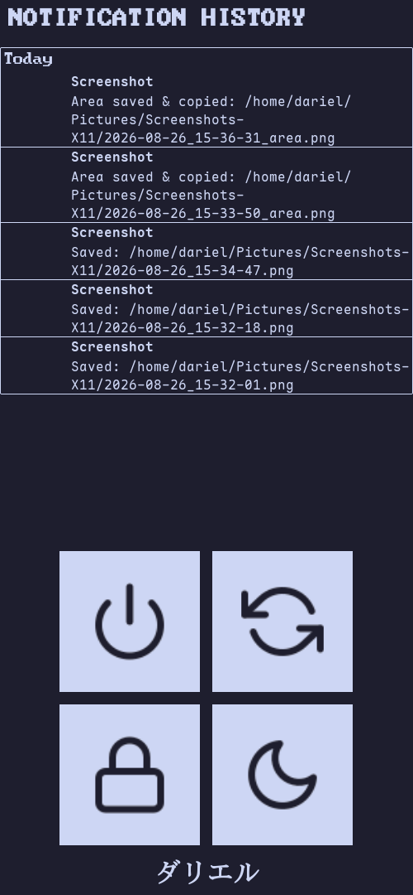

# AwesomeWM Dotfiles

This is my personal [AwesomeWM](https://awesomewm.org/) dotfiles repository, featuring a custom **Catppuccin Mocha** theme, a custom wibar, dashboard widgets, smooth slide animations, and a themed lock screen.

Below is a step-by-step guide on how to set it up.

## 📋 Table of Contents

- [Overview](#overview)
- [Prerequisites](#prerequisites)
- [1. Window Manager](#1-window-manager)
- [2. Lock Screen](#2-lock-screen)
- [3. Demo/Screenshot](#3-demoscreenshot)
- [4. Directory Tree](#4-directory-tree)
- [5. Tech Stack](#5-tech-stack)
- [License](#license)

## Overview

- **Theme:** Catppuccin Mocha
- **Wibar:** custom top bar with app launcher, system tray, and widgets
- **Dashboard:** left dashboard with CPU, memory, disk, battery, brightness, volume, calendar, and time widgets
- **Right Dashboard:** secondary quick-access panel
- **Animations:** smooth slide-in/slide-out effects powered by [rubato](https://github.com/andOrlando/rubato)
- **Lock Screen:** custom `betterlockscreen` setup with a blurred/dimmed wallpaper

## Prerequisites

Make sure the following are installed before setting up the dotfiles:

- [AwesomeWM](https://awesomewm.org/) (`awesomewm-git` recommended for the latest features)
- [betterlockscreen](https://github.com/betterlockscreen/betterlockscreen) (lock screen)
- [feh](https://feh.finalrewind.org/) (wallpaper handling)
- A [Nerd Font](https://www.nerdfonts.com/) (e.g. `BigBlueTermPlus Nerd Font Propo`) for icons and glyphs
- `git` (to clone this repository)

> Some widgets (battery, volume, brightness, network) may require additional CLI tools such as `acpi`, `pactl`, or `brightnessctl` depending on your system setup.

## 1. Window Manager

**Step 1:** Install AwesomeWM.

If you are using Arch/CachyOS, you can install it like this:

```bash
yay -S awesomewm-git
```

**Step 2:** Clone this repository into `~/.config`.

```bash
cd ~/.config
git clone https://github.com/88kbleirad/my-awesomewm-dotfiles.git
mv my-awesomewm-dotfiles awesome
```

**Step 3:** Restart Awesome.

- Restart with keybind:

```bash
Alt + Shift + r
```

- Restart with right-click menu:

```
Right-click on the desktop -> select "awesome" in the menu -> click "restart"
```

## 2. Lock Screen

I use `betterlockscreen`. Here's how to set it up:

**Step 1:** Install `betterlockscreen`.

```bash
yay -S betterlockscreen
```

**Step 2:** Create the `betterlockscreenrc` config file.

```bash
mkdir -p ~/.config/betterlockscreen
cd ~/.config/betterlockscreen
touch betterlockscreenrc
```

**Step 3:** Configure `betterlockscreenrc`.

This is my Catppuccin Mocha config:

```bash
locktext="Enter password to unlock"
font="BigBlueTermPlus Nerd Font Propo"
time_format="%H:%M:%S"
bgcolor="1e1e2eff"
loginbox="1e1e2ecc"
loginshadow="11111b66"
ringcolor="b4befeff"
insidecolor="1e1e2ecc"
separatorcolor="6c7086ff"
ringvercolor="89b4faff"
insidevercolor="313244cc"
verifcolor="89b4faff"
veriftext="Checking..."
ringwrongcolor="f38ba8ff"
insidewrongcolor="45475acc"
wrongcolor="f38ba8ff"
wrongtext="Wrong Password!"
timecolor="cdd6f4ff"
greetercolor="cdd6f4ff"
layoutcolor="cdd6f4ff"
keyhlcolor="a6e3a1ff"
bshlcolor="f38ba8ff"
modifcolor="f9e2afff"
wallpaper_cmd="feh --bg-fill"
```

**Step 4:** Inside the `awesome` directory, create a `scripts` directory and a `lock.sh` file.

```bash
mkdir -p ~/.config/awesome/scripts
cd ~/.config/awesome/scripts
touch lock.sh
```

```bash
#!/usr/bin/env bash
betterlockscreen -u ~/.config/awesome/Pictures -q >/dev/null 2>&1
betterlockscreen -l dimblur
```

**Step 5:** Make the script executable and run it.

```bash
chmod +x ~/.config/awesome/scripts/lock.sh
~/.config/awesome/scripts/lock.sh
```

or:

```bash
cd ~/.config/awesome/scripts
./lock.sh
```

## 3. Demo/Screenshot

<p align="center"><b>Wibar</b></p>
<p align="center">
  
</p>

<p align="center"><b>Dashboard</b></p>
<p align="center">
  
</p>

<p align="center"><b>Right Dashboard</b></p>
<p align="center">
  
</p>

<p align="center"><b>Lock Screen</b></p>
<p align="center">
  
</p>

## 4. Directory Tree

```
awesome/
├── binds
│   ├── keybind.lua
│   └── mouse.lua
├── effects
│   └── slide_from_right_to_left.lua
├── error.lua
├── layouts
│   └── layout.lua
├── lib
│   └── rubato
│       ├── easing.lua
│       ├── init.lua
│       ├── manager.lua
│       ├── rubato-1.2-1.rockspec
│       ├── subscribable.lua
│       └── timed.lua
├── main.lua
├── Pictures
│   ├── Rimuru_1.jpeg
│   ├── Rimuru_2.jpeg
│   ├── Rimuru_3.jpeg
│   ├── Rimuru_4.jpeg
│   ├── Rimuru_5.jpeg
│   ├── Rimuru_6.jpeg
│   ├── Rimuru_7.png
│   └── Rimuru_8.png
├── rc.lua
├── rc.lua.bak
├── README.md
├── rules
│   └── rule.lua
├── screenshot.lua
├── scripts
│   └── lock.sh
├── themes
│   └── init.lua
└── widgets
    ├── dashboard.lua
    ├── Dashboards
    │   ├── app-box.lua
    │   ├── battery.lua
    │   ├── brightness.lua
    │   ├── calendar.lua
    │   ├── cpu.lua
    │   ├── disk.lua
    │   ├── memory.lua
    │   ├── time.lua
    │   └── volume.lua
    ├── right-dashboard.lua
    ├── wallpaper.lua
    └── wibar.lua
```

## 5. Tech Stack

- **Lua** – AwesomeWM configuration and widgets
- **Bash** – setup and lock screen scripts

## License

This project is licensed under the [MIT License](LICENSE) — feel free to use, modify, and share it.
